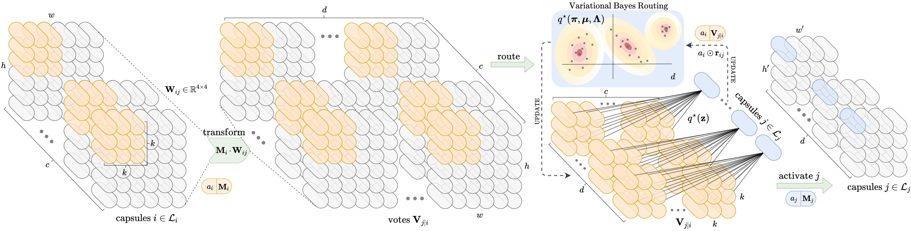

# Capsule Routing via Variational Bayes (AAAI 2020)


[Official Pytorch implementation]

Examplary code for our AAAI 2020 [paper](https://aaai.org/ojs/index.php/AAAI/article/view/5785/5641) on capsule networks.

**Author**: Fabio De Sousa Ribeiro \
**E-mail**: [fdesousaribeiro@lincoln.ac.uk](mailto:fdesousaribeiro@lincoln.ac.uk)

## Overview
Modular **vb-routing** and **conv capsule** layers so you can stack them to build your own capsnet to play around with.

```python

self.Conv_1 = nn.Conv2d(in_channels=2, out_channels=64,
    kernel_size=5, stride=2)

self.PrimaryCaps = PrimaryCapsules2d(in_channels=64, out_caps=16,
    kernel_size=3, stride=2, pose_dim=4)

self.ConvCaps = ConvCapsules2d(in_caps=16, out_caps=5,
    kernel_size=3, stride=1, pose_dim=4)

self.Routing = VariationalBayesRouting2d(in_caps=16, out_caps=5,
    cov='diag', pose_dim=4, iter=3,
    alpha0=1., # Dirichlet(pi | alpha0) prior
    m0=torch.zeros(4*4), kappa0=1., # Gaussian(mu_j | m0, (kappa0 * Lambda_j)**-1) prior
    Psi0=torch.eye(4*4), nu0=4*4+1) # Wishart(Lambda_j | Psi0, nu0) prior

```

**97.1%** test acc on smallNORB with just 1 caps layer. \
**98.7%** with 3 caps layers (as in [paper](https://arxiv.org/pdf/1905.11455.pdf)).
For more [see the poster](https://github.com/fabio-deep/Variational-Capsule-Routing/blob/master/images/Poster_AAAI2020.pdf) in `images/Poster_AAAI2020.pdf`.
## Run
```
python src/main.py
```
**Dataset Download**

1. You can download [smallNORB](https://drive.google.com/open?id=1AinL9mBzDzd0OC2R05tWVeGtJi_vGi1D) in .npy format and already resized to 48x48 for convenience.

### Citation
```
@inproceedings{ribeiro2020capsule,
  title={Capsule Routing via Variational Bayes.},
  author={Ribeiro, Fabio De Sousa and Leontidis, Georgios and Kollias, Stefanos D},
  booktitle={AAAI},
  pages={3749--3756},
  year={2020}
}
```
